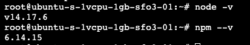
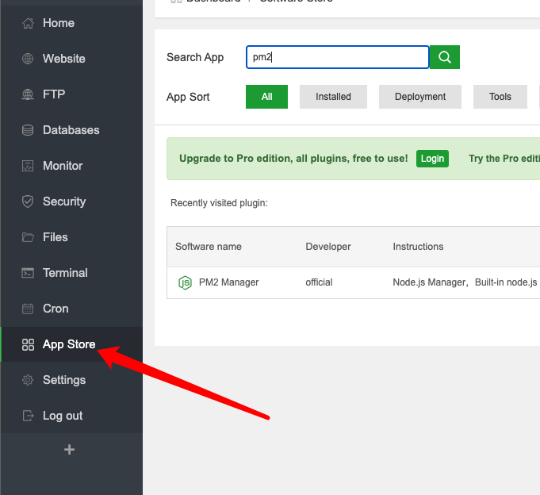

## Background

For students who takes ==COMP 4537 ISO==in BCIT, you have to deploy multiple websites in cloud, and many of you guys don't have experience on ==Cloud Computing== or Hosting websites.

This article would teach you how to deploy your projects (static `HTML` files and `React` Projects) with ==HTTPS== in the easiest and cheapest way.

## Precondition

It wouldn't need ==any== coding knowledge. You only need to type some Linux commands at first, and then you can host your projects via your panel website.

You do need a ==debt card== or ==credit card==.

## Technologies That Would Be Used 

* [Github Student Pack](https://education.github.com/pack)
* VPS Provider: [DigitalOcean Student Pack](https://www.digitalocean.com/github-students/)
  * You would get ==$100== free amount for your VPS
  * The cheapest Linux VM costs only ==$5== monthly, and that's enough for deploying small projects (I prefer the ==$10== version...)
  * You can switch to [AWS EC2](https://aws.amazon.com/ec2/?did=ft_card&trk=ft_card&ec2-whats-new.sort-by=item.additionalFields.postDateTime&ec2-whats-new.sort-order=desc) which also provides 1 year free Linux VM, but you have to enable Port 80(HTTP), 443(HTTPS) and 8888(aaPanel) in your security group
* Hosting Control Panel: [aaPanel](https://www.aapanel.com/index.html)
  * It would be used for ==deploying and managing== your projects
  * If you prefer Chinese, you can use the chinese version [宝塔终端](https://www.bt.cn/)
* [Node.js 14.17.6 (Stable Version)](https://nodejs.org/en/)

* Reverse Proxy: [Nginx](https://nginx.org/en/)
* [PM2](https://pm2.keymetrics.io/)
* SSL: [Let's Encrypt](https://letsencrypt.org/)

## Sponsor Me

You can also click the following icon for your registration. You would also get $100 in credit, and I would get $25 if you spent $25. If you think this article is helpful, come back and click it to sponsor me👍.

<a href="https://www.digitalocean.com/?refcode=4ee6db06cfe2&utm_campaign=Referral_Invite&utm_medium=Referral_Program&utm_source=badge"></a>

## Buy a Domain

In case to enable `HTTPS`, you need a domain. Usually it is not expensive, approximately ==$12== per year. 

You can choose one of the domain providers in:

* [GoDaddy](https://ca.godaddy.com/)
* [AWS Route 53](https://aws.amazon.com/route53/) (It provides free SSL but you have to use EC2 and LoadBalancer)
* [Google Domains](https://domains.google/) (Currently I am using this)
* [namecheap](https://nc.me/) (Free Domain and 1 year SSL, but I never use it)

## Create a Droplet

1. Go to dashboard of `digitalOcean`.

2. At the left side bar, choose ==Droplets== and Create it.

   

2. Pick Ubuntu 20.04 and select Basic version.

   

3. Check IPV6 and choose the authentication. You can click `New SSH Key` to create one.

   

4. Give it a name (I name it "Test") and Click `Create Droplet`.

5. You would see this in your page.

   

## Install aaPanel

### SSH into the instance

​	click `Launch Droplet Console` in `Access` page


### Install aaPanel

​	Copy the following command and paste to the pop-up terminal

```ba
wget -O install.sh http://www.aapanel.com/script/install-ubuntu_6.0_en.sh && sudo bash install.sh
```

### Remember the Address, Username and Password

Once the install process done, you would see the consoles below, be sure to write the information down.


You can ==close the terminal== now since we no longer need it.

## Install Required Dependencies

### Login to the Panel

Copy the ==Internet Address== you have seen before, enter the Username and Password.


### Install Dependencies

We need to install `Nginx` so we can choose LNMP. Choose `Compiled` for best performance.  


We can close the Message Box now and open the terminal, enter your password or paste your private key in it.


Type the following command in terminal to install `nodejs`

```bash
curl -fsSL https://deb.nodesource.com/setup_lts.x | sudo -E bash -
sudo apt-get install -y nodejs
```

Check nodejs and npm version by typing 

```bash
node -v
npm --v
```



Install `yarn` via npm

```bash
npm install -g yarn
```

Intall `pm2` via yarn

```bash
yarn global add pm2
```

Check `yarn` and `pm2` version


### Install PM2 in App Store

Click `App Store` in side menu and search pm2, click install and check ==Display on dashboard==




## Connect your Domain with the Instance (DNS)

We need to make some records that connect the `IPV4` and `IPV6` address of the instance, so all the traffic from your domain would be direct to your instance. 

Open the website of your Domain Provider, you would see an option like `Manage DNS` , and you might see some default `Records`, click `Create/Add Records`

There are two types of record you have to create:

* Type A: `IPV4`
* Type AAAA: `IPV6`

Suppose your domain is `aaa.com`, then create both 3 Type A records and Type AAA records

| Record Name | Record Type | Value        |
| ----------- | ----------- | ------------ |
| aaa.com     | A           | IPV4 Address |
| www.aaa.com | A           | IPV4 Address |
| *.aaa.com   | A           | IPV4 Address |
| aaa.com     | AAAA        | IPV6 Address |
| www.aaa.com | AAAA        | IPV6 Address |
| *.aaa.com   | AAAA        | IPV6 Address |

`*` means you are enabling the traffic of all sub domains, like ==sub.aaa.com==

You definitely can disable this option, as long as you add two records for ==sub.aaa.com== 

## Deploy static HTML Website

In the side menu, click ==Website== and `Add site`


Enter your `domain`, if your domain is aaa, you should enter:

>www.aaa.com
>
>aaa.com

No need to check anything, Click ==Submit==


You can edit the folder in `/www/wwwroot` where all of your websites would be deployed.

You would see this default page showing below when you access your domain.


## Enable HTTPS

In case to enable HTTPS, you have to get a SSL. Definitely you can buy it in your domain provider, but the price is also `unacceptable` (For me), and the most annoying thing is one SSL might only apply for one domain (Exclude Sub-Domains). If you don't want to buy multiple SSL for your domain and its Sub-Domains, you probably need a [Wildcard certificate](https://en.wikipedia.org/wiki/Wildcard_certificate)

### Get a SSL for your domain

You can use ==Let's Encrypt== in aaPanel, and get your SSL via DNS verification.


Add the following Records in your domain provider page.


Once you done, click `verification` and get your SSL that includes ==Private key (KEY)== and ==Certificate==. Save them in somewhere, you would need them for all of your websites.

### Add SSL in your website to enable HTTPS

Create a new site with your sub domain, such as `test.aaa.com`


Paste your `Key` and `Certificate`, Enable `Force HTTPS`


Make sure to add a Record in your DNS, now you can access your website with `https://` prefix. Like `https://test.aaa.com`

## Reverse Proxy and Port forwarding

I want you to read this article [What Is a Reverse Proxy Server?](https://www.nginx.com/resources/glossary/reverse-proxy-server/?_bt=541137080527&_bk=&_bm=b&_bn=g&_bg=125748574545&gclid=Cj0KCQjw-NaJBhDsARIsAAja6dOPQkNj6srCLoU-fMoyLd__WalcHKOnIyLgbddbgJFl2vO4DoymOuMaAtKoEALw_wcB) since we would use `Nginx` as reverse proxy server. 

Mainly we would use [Port forwarding](https://en.wikipedia.org/wiki/Port_forwarding). If you ever use `React`, you know when you `npm run start` your server would listen on ==Port 3000== by default, but when you host your project to heroku, you won't see anything like `myproject.heroku.com:3000`, you only see `myproject.heroku.com`. We can use `Nginx` to forward the port from 3000 to 80 (HTTP), so the user would never know where the real listening port is, and you don't have to open Port 3000 in your security group.

## Host a React Project in Two ways

Create a new site names `react.[yourdomain].com`, and add SSL to enable HTTPS, ==delete== the project folder in your `/www/wwwroot`.

Open the Terminal in `/www/wwwroot`


Install simple react project by typing:

```bash
npx create-react-app test
```

We can deploy a react project in either ==Dev mode== or ==Production mode==. I strongly recommand using ==Production mode== since it can boost your performance and save the server resource.

> The reason to use `pm2` is we want to run the project permantly. Without `pm2` If we kill the terminal process, the service would also be killed.

### ~~Dev Mode~~

Within the ==test== folder, open terminal, and type

```bash
pm2 start "npm run start" --name test
```

You would see the console like that


Go to ==Home Page==, select ==PM2 Manager==


You would see a process names `test` which is listening on port 3000, it is ok if you don't see it.

You can set the Port to any you like, I set to 3000


In Site Manager, change the Site directory into `test` folder.


Click `Reverse proxy` in side menu, click `Add reverse proxy`.


Enter the name you like, and the Target URL would be `http://127.0.0.1:your_port`, Click Submit.


Visit your website, wow~


---

### Production Mode

cd to `test` folder, open `package.json`, change "start" script into `serve -s build -p 3000`


open the terminal and install `serve` dependency, build the project

```bash
yarn add serve
yarn build
```

Restart `test` process

```bas
pm2 restart test
```

if you never open this process, type

```bash
pm2 start "npm strat" --name test
```

Finally, You see the build version here~

